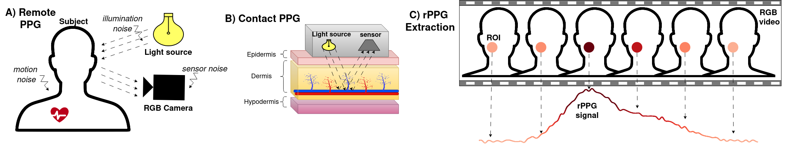
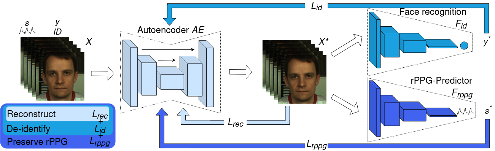

# De-identification of facial videos while preserving remote physiological utility
This is the official code repository of our BMVC 2023 paper "De-identification of facial videos while preserving remote physiological utility". Our method can de-identify videos from machines, while preserving the visual quality and unerlying rPPG signals. For more details, please read our pubblication.

[Paper](add link), [Poster](add link), [Video](add link)





## Dataset Preprocessing

The original videos are firstly preprocessed to crop and resizethe videos intro T=64 long video segments with 128x128 pixel frames. In the example code we assume the data used in pre-processed from PURE dataset, but can't provide the actual data or preprocessed files. Facial landmarks are computed with Dlib and saved into a .npy file, for each clip a binary mask is computed based on the landmarks than can be used for traditional methods. The strcuture of the data that can be used with our dataloader is: <br>
Dataset1: <br>
├── Sample1  <br>
├──├── blocks (containts [64,128,128] ordered segments of videos) <br>
├──├──├── 001.npy  <br>
├──├──├── XXX.npy <br>
├──├── mask (containts [64,128,128] ordered masks of videos, useful for traditional methods) <br>
├──├──├── 001.npy <br>
├──├──├── XXX.npy <br>
├──├── bvp.npy ( array with grountruth bvp signal [T]) <br>
├──├── lnd.npy ( array containing landmarks [T,68,2]) <br>
<br>
If your dataset is processed in this way, with some minimal code changes you can use our dataloader as described by the following steps.
First in the folds folder create a new labels txt file similar as the one provided for PURE and run create_rppg_folds_blocks_PURE.py to create a list of training and validation samples. 

## Pre-training
Please make sure your dataset is processed as described above. The rPPG networks and De-identification networks are all pre-trained using the following scripts. They all use the load_cropped_blocks_rppg_pure.py dataloader, as it contains the real bvp groundtruth data, load_cropped_blocks_rppg_pure_withphysgt.py is meant only for autoencoder training as the groundtruth is replaced with rPPG method predictions obtained with the unaltered input data. <br>
Use train_idnet.py to train the ID recogniser networks on the chosen data. And the train_physformer.py, train_physnet, train_chrom (doesn't train but gets saves the signals for autoencoder training) to train the rPPG methods and save the signals that will be used with the load_cropped_blocks_rppg_pure_withphysgt.py dataloader.


### Training
Finally, when all the data processing and pre-training is done, you can use Train_Deid_rPPG.py to train your own utility preserving autoencoder.

## Citation

```

